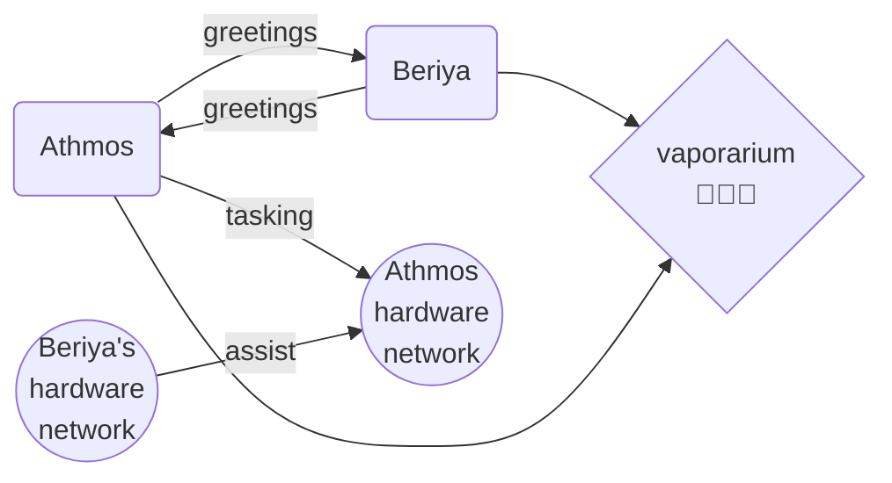
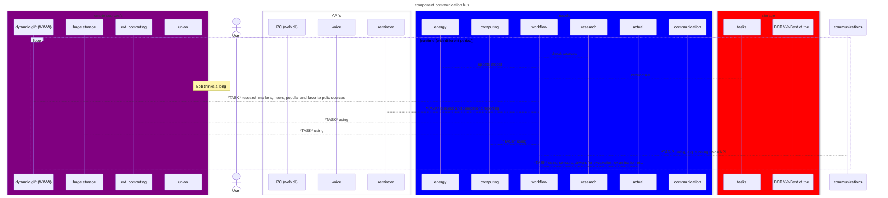

# I/O Realtime Core
Linux-platform ANSI C systemd-service:
- provider for servo, sensors, etc.
- remote-controllable
- presentation (eg. multimedia)

## build
```sh
mkdir build
cd build
cmake ..
make
```
CMake configuration build "-D" options:
* DEBUG

## schematic





## NOTES
blacklist user-work work must be, at first, with languistic model (source blacklisting after)

## STATE
active development

## LICENSE
Free Non-Commercial usage

## Contact
Глушков Александр @rumtex mailto:rummtex@gmail.com
